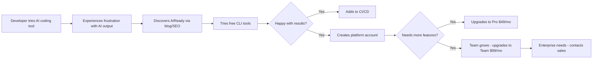
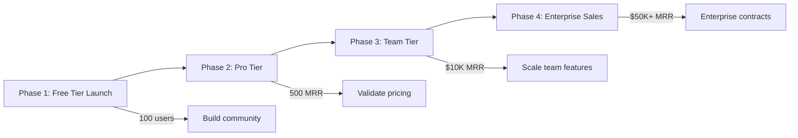
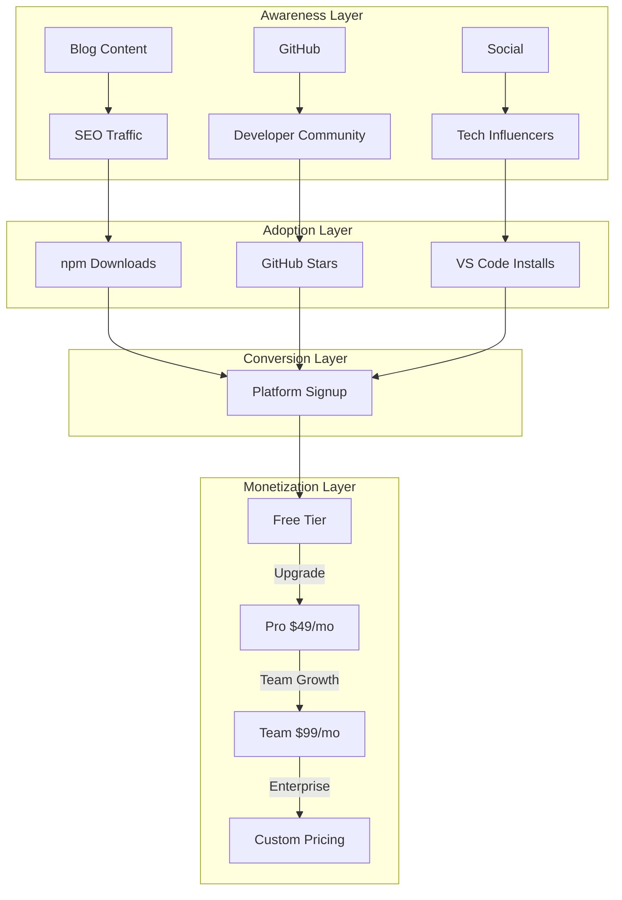

# AIReady Business Review

## Executive Summary

This document provides a comprehensive business review of the AIReady project - a multi-product ecosystem for assessing and improving codebase AI-readiness. The review covers target audience, product-market fit, value creation, profit model, and go-to-market strategy.

**Current State:** 
- Open-source tools: Published to npm, Docker Hub, GitHub Actions Marketplace
- SaaS Platform: MVP launched with Free tier, paid tiers planned
- Revenue Model: Freemium SaaS with $49-299+/month tiers

---

## 1. Target Audience

### Primary User Segments

| Segment | Description | Pain Points | Current Fit |
|---------|-------------|-------------|-------------|
| **Individual Developers** | Solo programmers using AI coding assistants (Cursor, Copilot, Claude) | Code becomes confusing to AI models over time; context window limits | ✅ High - CLI tools are free and solve immediate problems |
| **Small Dev Teams** | 2-10 person teams with shared codebases | Inconsistent patterns across contributors; duplicated logic | ✅ High - Team tier at $99/mo addresses collaboration needs |
| **AI-Forward Companies** | Organizations with strategic AI adoption programs | Need to measure and improve codebase "AI-friendliness" | ✅ High - Enterprise tier with custom pricing |

### Secondary User Segments

| Segment | Description | Opportunity |
|---------|-------------|-------------|
| **DevOps Engineers** | Managing CI/CD pipelines | GitHub Action for automated scanning |
| **Engineering Managers** | Overseeing code quality across teams | Platform dashboard with trends & benchmarks |
| **Technical Consultants** | Advising clients on AI adoption | Open-source tools for client assessments |

### User Journey Map

---

## 2. Product-Market Fit Analysis

### Problem Statement

**The Problem:** As AI becomes deeply integrated into software development, codebases become harder for AI models to understand due to:
- Knowledge cutoff limitations in AI models
- Different coding style preferences across team members  
- Duplicated patterns AI doesn't recognize
- Context fragmentation that breaks AI understanding

### Solution Fit

| Problem | AIReady Solution | Validation Status |
|---------|------------------|-------------------|
| AI context window waste | pattern-detect finds semantic duplicates | ✅ Implemented |
| Code complexity confusion | context-analyzer measures cohesion & fragmentation | ✅ Implemented |
| Inconsistent patterns | consistency checks naming conventions | ✅ Implemented |
| Invisible debt | visualizer creates interactive graphs | ✅ Implemented |
| Manual remediation | remediation swarm agents (platform) | 🔄 In Development |

### Market Timing

**Favorable Trends:**
- AI coding assistants (Copilot, Cursor, Claude Code) are going mainstream
- Context window limits are becoming a bottleneck
- Companies are investing in "AI engineering" practices
- 95% language coverage (TS, JS, Python, Java, Go, C#)

**Competitive Landscape:**

| Competitor | Focus | AIReady Differentiation |
|------------|-------|------------------------|
| Traditional linters (ESLint, Pylint) | Syntax & style | AI-specific metrics (semantic duplicates, context cost) |
| CodeClimate, SonarQube | General code quality | AI-readiness scoring, context window analysis |
| GitHub Copilot metrics | AI usage analytics | Actionable remediation, codebase improvement |

### Product-Market Fit Indicators

**Strengths:**
- ✅ Multiple distribution channels (CLI, VS Code, GitHub Action, Docker)
- ✅ Open-source core creates developer trust
- ✅ Comprehensive analysis (patterns, context, consistency)
- ✅ Automated remediation capability (unique differentiator)

**Gaps:**
- 🔄 Limited marketing reach (early-stage)
- 🔄 Enterprise sales process not established
- 🔄 Community engagement needs scaling
- 🔄 Rust support on roadmap (Q4 2026)

---

## 3. Value Creation

### Core Value Proposition

**For Developers:** "Stop wasting AI context on duplicated patterns. AIReady quantifies and fixes the code smells that confuse AI models."

**For Teams:** "Make your codebase AI-friendly. Get automated improvements with human-in-the-loop review."

**For Enterprises:** "Strategic AI adoption requires measurable code quality. AIReady provides the metrics and remediation."

### Value Creation Matrix

| Value Type | Free Tools | Pro Tier | Team Tier | Enterprise |
|------------|-----------|----------|-----------|------------|
| **Time Savings** | Manual insights | Automated trends | Team benchmarks | Custom rules |
| **Cost Reduction** | Less AI token usage | Optimized prompts | Reduced code reviews | SLA support |
| **Quality** | Consistency checks | Historical tracking | Team standards | Compliance |
| **Automation** | CLI scanning | Auto-remediation | PR gates | API access |

### Key Metrics Delivered

- **AI Readiness Score (0-100):** Composite metric of codebase AI-friendliness
- **Context Cost:** Token equivalent of understanding each file
- **Pattern Density:** Semantic duplicates per 1K lines
- **Cohesion Index:** Code organization quality
- **Remediation ROI:** Estimated time saved by fixes

### Unique Capabilities

1. **Semantic Duplicate Detection:** Finds code that looks different but does the same thing - a major context window waste
2. **Context Budget Analysis:** Quantifies how much "AI effort" each file requires
3. **Automated Remediation:** AI agents that can automatically fix issues (with human approval)
4. **Visual Force-Directed Graphs:** Interactive visualization of code relationships

---

## 4. Profit Model

### Current Pricing Structure

| Tier | Price | Features | Target |
|------|-------|----------|--------|
| **Free** | $0 | 3 repos, 10 runs/mo, 7-day data, CLI tools | Individual developers, evaluation |
| **Pro** | $49/mo ($470/yr) | 10 repos, unlimited runs, 90-day data, trends, 5 AI refactoring plans/mo | Serious individual developers |
| **Team** | $99/mo ($950/yr) | Unlimited repos & members, team benchmarking, 20 AI refactoring plans/mo, CI/CD integration, PR Gatekeeper | Small to medium teams |
| **Enterprise** | Custom ($299+/mo) | Everything in Team + custom thresholds, API access, dedicated support, SLA | Large organizations |

### Revenue Streams

**Primary:**
1. **SaaS Subscriptions** - Monthly/annual platform subscriptions
2. **AI Refactoring Plans** - Consumable credits for automated fixes (5-20/mo depending on tier)

**Secondary (Future):**
3. **Professional Services** - Custom integration, training, consulting
4. **Enterprise Licenses** - On-premise deployments (ClawMore infrastructure)

### Unit Economics

| Metric | Current | Target |
|--------|---------|--------|
| **CAC (Customer Acquisition Cost)** | ~$0 (organic) | <$100 |
| **LTV (Lifetime Value)** | TBD | >$2,400 |
| **LTV:CAC Ratio** | TBD | >3:1 |
| **Churn Rate** | N/A (new) | <5%/month |
| **Gross Margin** | ~70-80% (AWS infrastructure) | >70% |

### Profitability Roadmap

---

## 5. Marketing Strategy

### Positioning

**Primary Message:**
"AIReady helps teams assess, visualize, and prepare repositories for better AI adoption."

**Tagline:**
"Your code is AI-ready. Is it?"

**Key Differentiators:**
1. First-to-market with AI-specific code quality metrics
2. Automated remediation (not just detection)
3. Multi-language support (95% market coverage)
4. Open-source core builds trust

### Marketing Channels

| Channel | Status | Priority | Strategy |
|---------|--------|----------|----------|
| **Content Marketing** | Active | High | SEO-optimized blog posts, technical guides |
| **Developer Community** | Building | High | GitHub, Discord, Reddit engagement |
| **SEO/SEM** | Limited | High | Target "AI code quality", "reduce AI tokens" keywords |
| **Partner Channels** | Future | Medium | IDE vendors, AI tool partnerships |
| **Conferences** | Future | Medium | AI engineering conferences, DevRel events |
| **Paid Ads** | Not started | Low | Retargeting developers, LinkedIn for enterprises |

### Content Strategy

**Top-of-Funnel:**
- Blog posts on AI coding challenges
- "Invisible Codebase" series explaining AI context problems
- Tool educational content

**Middle-of-Funnel:**
- Case studies showing ROI
- Comparison guides (vs linters, code quality tools)
- Integration tutorials

**Bottom-of-Funnel:**
- Free tier as entry point
- Product documentation
- Demo videos

---

## 6. Distribution Channels

### Current Channel Status

| Channel | Status | Reach | Revenue Potential |
|---------|--------|-------|-------------------|
| **npm (@aiready/cli)** | ✅ Published | High | Indirect (leads to platform) |
| **GitHub Action** | ✅ Published | High | Indirect (leads to platform) |
| **Docker Hub** | 🟡 Ready | Medium | Indirect |
| **VS Code Extension** | 🟡 Scaffold | Medium | Direct + Indirect |
| **Homebrew** | 🟡 Formula Ready | Low | Indirect |
| **Platform (getaiready.dev)** | ✅ Live | Direct | Direct (SaaS) |

### Channel Strategy

**Open-Source Channels (Top of Funnel):**
1. **npm** - Primary distribution for CLI tools
2. **GitHub Actions** - CI/CD integration, automated scanning
3. **Docker** - Containerized environments
4. **VS Code** - IDE integration, real-time feedback

**Commercial Channel (Conversion Point):**
5. **Platform SaaS** - Full-featured dashboard, remediation, team features

### Distribution Architecture

---

## 7. Growth Strategy

### Phase 1: Product-Led Growth (Months 1-6)

**Focus:** Build developer awareness and adoption

**Tactics:**
- [ ] Optimize npm package for discovery (keywords, description)
- [ ] Publish 2-3 technical blog posts/month
- [ ] Engage in relevant Reddit threads, Hacker News
- [ ] Build GitHub repository (stars, issues, contributions)
- [ ] Launch VS Code extension to IDE market
- [ ] Create tutorial videos for CLI tools

**Metrics:**
- npm downloads: 1K/month → 10K/month
- GitHub stars: 100 → 1,000
- Platform signups: 0 → 500

### Phase 2: Platform Monetization (Months 6-12)

**Focus:** Convert free users to paid tiers

**Tactics:**
- [ ] Launch Pro tier with Stripe integration
- [ ] Implement usage limits (force upgrade prompts)
- [ ] Create comparison landing pages
- [ ] Add customer testimonials/case studies
- [ ] Start email nurture sequence for free users

**Metrics:**
- Pro subscribers: 0 → 100
- MRR: $0 → $5,000

### Phase 3: Team & Enterprise Scale (Year 2)

**Focus:** Land large accounts, establish sales process

**Tactics:**
- [ ] Launch Team tier with CI/CD features
- [ ] Build Enterprise sales playbook
- [ ] Attend AI engineering conferences
- [ ] Develop partner ecosystem
- [ ] Create custom integration offerings

**Metrics:**
- Team/Enterprise accounts: 0 → 50
- MRR: $5K → $50K+

---

## 8. Recommendations

### Immediate Priorities (Next 30 Days)

1. **Fix Security Issues** - Remove hard-coded credentials per clawmore-profit-readiness.md
2. **Complete Payment Integration** - Stripe webhooks, customer portal, subscription checkout
3. **Launch Pro Tier** - Activate $49/mo tier with all planned features
4. **Add Observability** - Error tracking (Sentry), structured logging, metrics

### Short-Term (30-90 Days)

5. **Scale Content Marketing** - Publish consistent blog schedule, target SEO keywords
6. **VS Code Extension** - Complete and publish to Marketplace
7. **Launch Team Tier** - Add team features, benchmarking, CI/CD integration
8. **Build Community** - Discord server, GitHub discussions, contributor program

### Medium-Term (90-180 Days)

9. **Enterprise Sales** - Build sales process, target 5 enterprise pilots
10. **Partner Channels** - Explore IDE vendor partnerships
11. **Add Languages** - Prioritize Rust (Q4 roadmap) based on demand
12. **International** - Consider localization for non-English markets

---

## 9. Risk Assessment

| Risk | Probability | Impact | Mitigation |
|------|-------------|--------|------------|
| **Market timing** - AI adoption slows | Low | High | Diversify to general code quality |
| **Competition** - Big players add AI features | Medium | Medium | Move fast, build community lock-in |
| **Technical debt** - Platform scalability | Medium | Medium | Invest in infrastructure early |
| **Security** - Data breaches | Low | Critical | Prioritize security hardening |
| **Channel dependency** - npm/VS Code policy changes | Low | Medium | Diversify distribution |

---

## 10. Summary

AIReady is well-positioned in an emerging market with:
- ✅ Strong product-market fit for AI developer tools
- ✅ Multi-channel distribution strategy
- ✅ Clear freemium monetization model
- ✅ Technical differentiation from competitors
- ⚠️ Early stage - needs execution on marketing & sales

**Key Success Factors:**
1. Rapid developer adoption through open-source channels
2. Successful Pro tier launch and monetization
3. Building community and brand recognition
4. Delivering on automated remediation (unique value)

**Revenue Potential:**
- Conservative: $10K MRR by Month 12
- Target: $50K MRR by Month 24
- Stretch: $100K+ MRR with enterprise traction

---

*Document Generated: March 2026*
*For: AIReady Business Review*
*Status: Draft for Discussion*